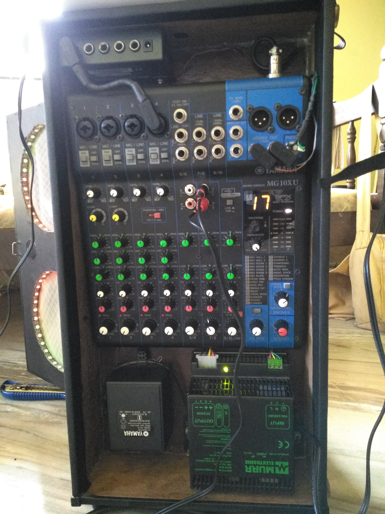

# Sound reactive speaker (stereo)

This program runs using the Arduino core on Espressif ESP32. It is based largely on the stereo version of the code developed by @G6EJD here: https://github.com/G6EJD/ESP32-8-Octave-Audio-Spectrum-Display as well as my own code previously used with the MSGEQ7 spectrum analyzer chip.

The code is written in Notepad++ and compiled using Platformio (in my case, command-line). It should work straight out of the box once the libraries (below) and the Arduino Core for ESP32 is installed: https://github.com/espressif/arduino-esp32

Libraries needed:

- ArduinoFFT: https://github.com/kosme/arduinoFFT
- FastLED: https://github.com/FastLED/FastLED
- Blynk: https://github.com/blynkkk/blynk-library
- Built-in WiFi and ArduinoOTA libraries

See the lights in action here: [Instagram](https://www.instagram.com/p/BfJb-3ajXb_/)

Speaker front view

Speaker rear view

Mixer close up

Front panel open

Arduino/MSGEQ7 wiring

ESP32 wiring

